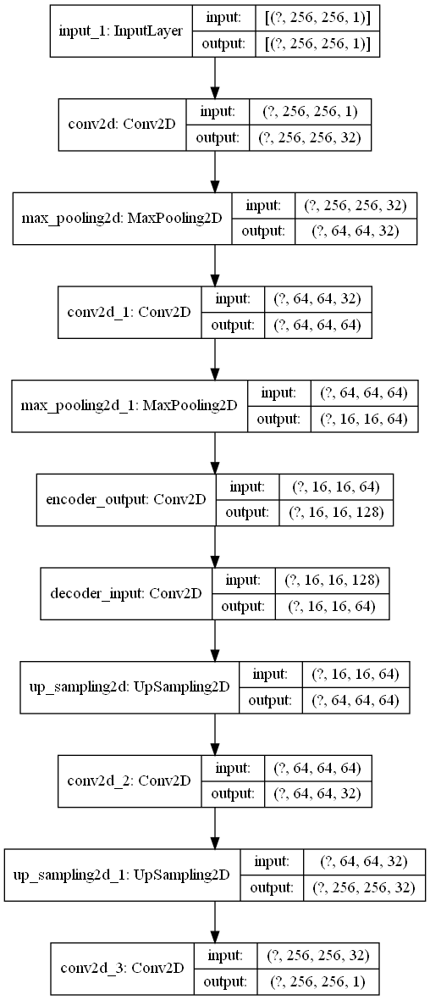
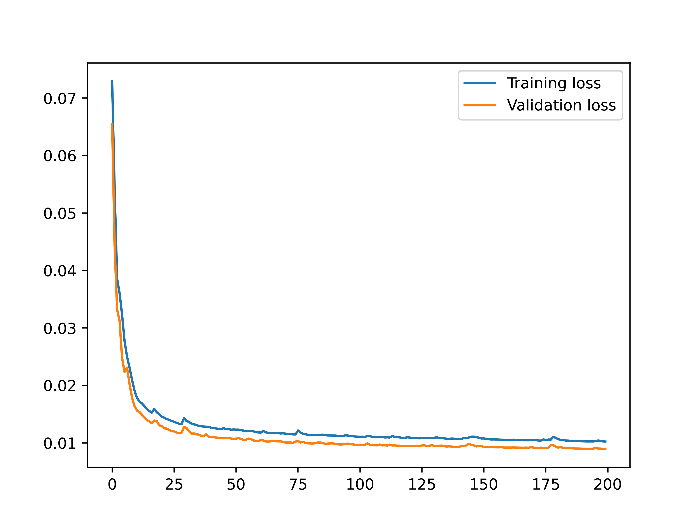
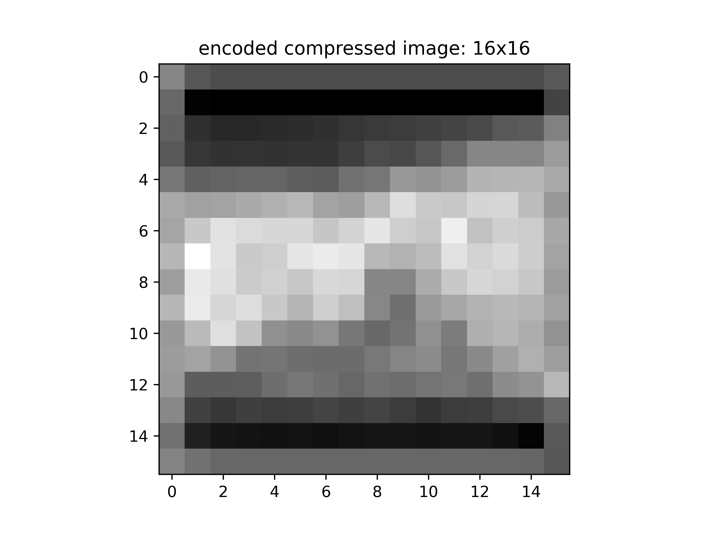
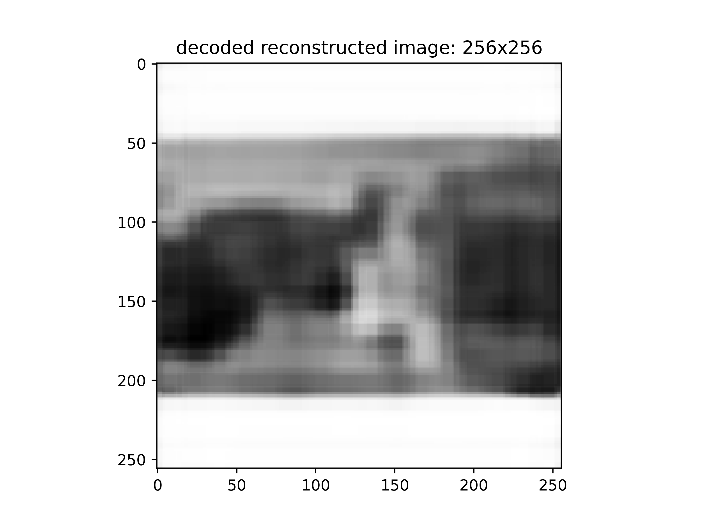
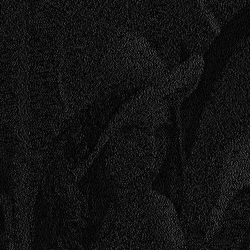

# Deep_learning_in_image_Cryptography
Deep learning in image Cryptography

This repository contains code for image encryption and decryption using chaotic map sequence and autoencoder. It also includes code for generating chaotic map sequences, shuffling and deshuffling images, preparing datasets, and computing performance metrics
## Environment setup
```bash
conda env create --file environment.yml
```

## 1. Chaotic map sequence generation
To generate the chaotic map sequence, run the following command:
```bash
python generate_chaotic_map_sequence.py
```
## 2. Shuffle and Deshuffle image
To shuffle and deshuffle an image, run the following command:
```bash 
python shuffling_deshuffling_images.py
```
 Input image


<!--  -->

Shuffle image 


Deshuffle image


## 3. Encryption and Decryption of image using chaotic map sequence
To encrypt and decrypt an image using chaotic map sequence, run the following command:
```bash
python image_encryption_decryption.py
```
encryption of image


decryption of image


## 4. Dataset preparation 
To prepare the dataset, run the following command:
```bash
python data_loader.py
```

## 5. Autoencoder for image encryption and decryption
To use the autoencoder for image encryption and decryption, run the following command:
```bash
python auto_encoder.py
```

Model architecture




Model training
```bash
python train.py
```
Model loss performance graph



## 6. Inferencing the model

original_vs_compressed_vs_reconstruction

```bash
python inference.py
```
original image


encoder compressed image



decoder decompressed image



## 7. Performance metrics

- Structural Similarity Index (SSIM)

```bash
python structural_similarity_SSIM_calculation.py
```
- Number of pixel change rate (NPCR)

```bash
python nnumber_of_pixel_change_rate_NPCR_comparision.py
```
- NPCR computation

image 1 output


image 2 output


- Unified Average Changing Intensity (UACI)

```bash
python unified_average_changing_intensity_UACI_comparision.py
```


## 8. Salt and paper noise
    
 ```bash
   python salt_and_pepper_noise.py
```

Noisy image

   